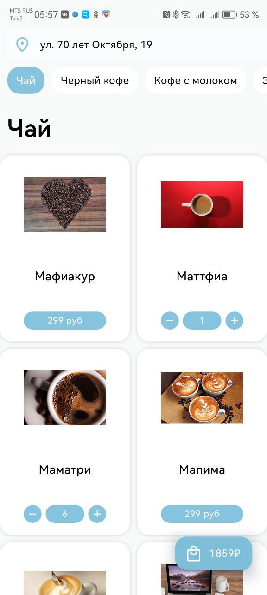
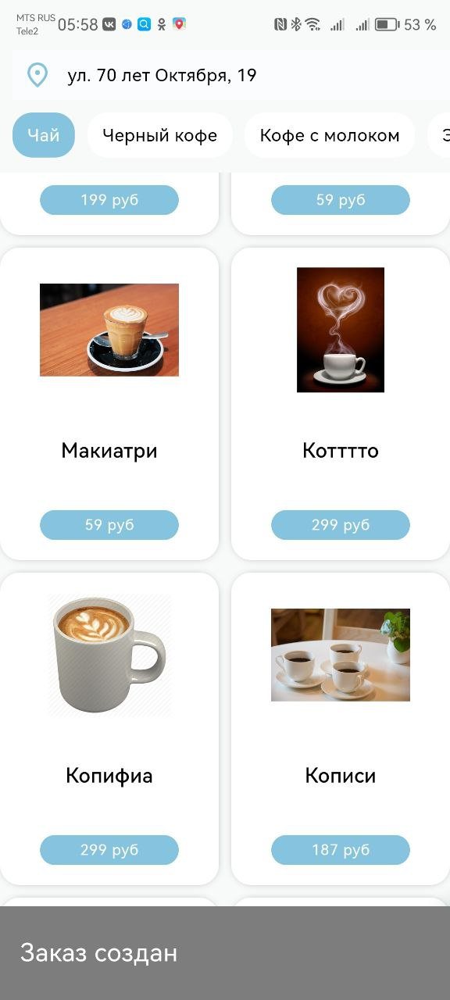
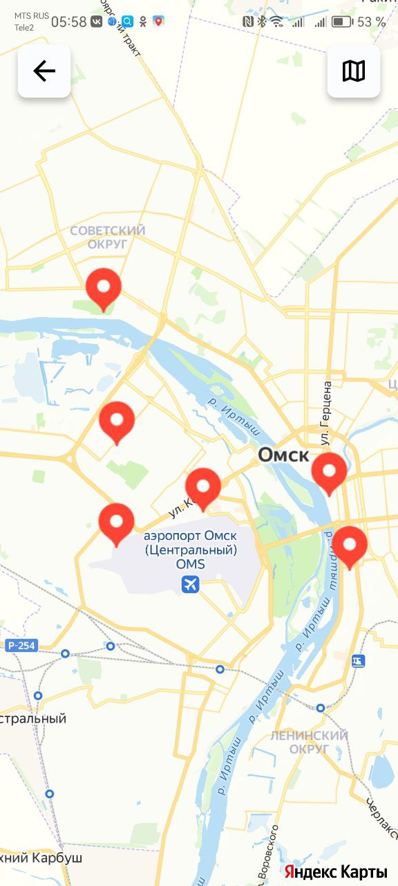

# Описание проекта


<div class="container" style="margin-bottom: 25px">
  
  
  
</div>

Данная работа была выполнена в рамках прохождения курса «Профессиональная разработка мобильных приложений» от компании Effective с целью получения первичных навыков в работе с фреймворком для кроссплатформенной разработки мобильных приложений __Flutter__.
-

В ходе разработки было разработано приложение для сети кофеен по городу Омску __Siberian Coffee__. Приложение включает в себя следующий функционал:

- возможность просмотра товаров на главной странице;
- возможность составления из товаров пользовательского;заказа (реализована корзина, с возможностью ее очистки);
- реализован счетчик количества определнных товаров (максимум 10 для одного вида товара);
- реализована верхняя панель с категориями товаров: меню скроллится, при выборе категории экран автоматически проскроллится до нужных позиций на экране. При скролле пользователя товаров категория будет автоматически подбираться в зависимости от преобладающего вида товаров на экране у пользователя в данный момент;
- возможность просматривать адреса кофеен с помощью сервиса __Yandex Maps__ ;
- возможность выбора адреса хранения с долгосрочным хранением (в том числе после выхода приложения);
- возможность просмотра всей страницы с адресами кофеен;
- возможность получения уведомлений в виде снекбаров (отображающих статус заказа на уровне клиента) и пуш уведомлений (статус заказа на уровне сервера).

Архитектурно приложение представляет собой связку клиент-сервер. Разработка велась преемущественно в соответствии с чистой архитектурой.

Основные пакеты, применяемые на проекте: 
- ```bloc: ^8.1.3``` - для управления состояниями внутри приложения, стейт-менеджер;
- ```dio: ^5.4.1``` - HTTP клиент для работы с сервером (получение и отправка данных, просмотр статусов обращений);
- ```drift: ^2.17.0``` - для хранения данных колоночного типа, в частности сущностей. Ввиду связности сущностей было решено реализовать реляционную базу данных вместо хранения сериализованных объектов;
- ```shared_preferences``` - для хранения данных на уровне для одного пользователя (адрес текущей кофейни, fcm токен);
- ```firebase_messaging: ^15.0.1``` - для настройки push-уведомлений;
- ```yandex_mapkit: ^4.0.2``` - для управления картами внутри приложения.

### Приложение разрабатывалось и тестировалось только в пределах операционной системы Android !

### Flutter SDK: 3.22.1

### Dart SDK: 3.4.1

## Гайд по установке приложения:
1) Подготовить машину с ```<= 3.0.0 flutter sdk <= 4.0.0``` и иметь IDE, девайс (либо эмулятор) для запуска приложения;
2) Склонировать git репозиторий: ```https://github.com/Vladislav-Zyuzko/SiberianCoffee.git```
3) В проектной папке прописать команду ```flutter pub get``` для получения зависимостей;
4) Выбрать в менеджере девайсов мобильное устройство, на котором будет запущено приложение;
5) Запустить команду ```flutter run lib/main.dart``` из корня проекта.

Приложение поддерживает как русскую локализацию, так и англоязычную в зависимости от выбранного системного языка. 

Ниже представлены основные экраны, полученные в ходе разработки:



<br>
<br>
<br>


<br>
<br>
<br>



<br>
<br>
<br>



<br>
<br>
<br>


<br>
<br>
<br>
